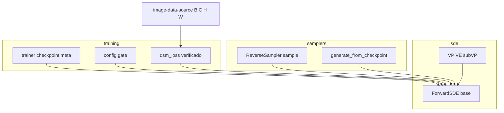

# Design Document — `nd-shapes`

## Overview

**Purpose**: hacer que la familia escalar de SDEs (VP/VE/sub-VP) y los samplers operen sobre **cualquier
event shape** —el toy 2D `(B, 2)` y las imágenes `(B, C, H, W)`— por broadcasting, sin hardcodear
dimensiones. Es el último bloqueo del camino de imágenes de Fase 2.

**Users**: el autor del TP, para entrenar y samplear imágenes `(B, 3, 64, 64)` reusando el mismo marco
que el toy 2D.

**Impact**: cambio quirúrgico y backward-compatible. La matemática de las SDEs no cambia; solo se
generaliza el **broadcasting de los coeficientes dependientes de `t`** (hoy fijados a `(B, 1)`) y la
**geometría del dato** (hoy un `int`). El toy 2D queda byte-idéntico.

### Goals
- La familia escalar (`perturb`/`score_target`/`sde`/`marginal_prob`) produce shapes correctas y
  broadcast correcto para `x` de rango arbitrario.
- Los samplers muestrean el prior y generan muestras `(n_samples, *event_shape)`.
- La forma del dato es un parámetro (entero o tupla), viaja por la metadata de checkpoint y permite
  reconstruir la SDE de imágenes para generar.
- Backward-compatible: el toy 2D no cambia de comportamiento; suite existente en verde.

### Non-Goals
- CLD (no existe en el código).
- La red `ScoreUNet` y la fuente `image-data-source` (ya entregadas).
- Corridas reales de entrenamiento de imágenes, GPU, métricas FID/IS, visualización/des-normalización.
- Ergonomía completa de entrenamiento de imágenes **config-driven por YAML** (el camino soportado para
  imágenes en esta spec es la API de Python `train(sde, model, data, config)`).

## Boundary Commitments

### This Spec Owns
- La **expansión temporal rank-aware** y el **broadcasting N-D de la familia escalar** en `sde`
  (`base.py`, `variants.py`).
- La **geometría del dato como parámetro** de `ForwardSDE` (entero o tupla) y su exposición como una
  forma de evento normalizada.
- El **prior N-D** en `samplers` (`base.py sample()`): la única línea con shape plana. El `_expand_t`
  del sampler, el driver y los `step()` de los 4 samplers **no cambian** (ya operan sobre `x.shape`).
- El **round-trip de la forma** por la metadata de checkpoint (`training/trainer.py` →
  `samplers/generate.py`) y el **gate mínimo** en `training/config.py` para que una forma-tupla no se
  inyecte como hiperparámetro del modelo.
- Tests parametrizados 2D + imagen-chica en `tests/test_sde.py` y `tests/test_samplers.py`.

### Out of Boundary
- La red, la fuente de imágenes, la evaluación/visualización, y las corridas reales de imágenes.
- El loop de entrenamiento en sí: `dsm_loss` **se verifica** N-D-safe (se espera **sin cambios**),
  no se rediseña.
- La ergonomía YAML de entrenamiento de imágenes config-driven (más allá del gate mínimo de `config.py`).

### Allowed Dependencies
- `torch` (broadcasting nativo; 2.12 CPU). **Sin dependencias nuevas.**
- Dirección de dependencias preservada: `sde ← samplers`; `training`/`generate` consumen `sde` vía
  `make_sde`. Ningún import hacia arriba nuevo.
- Reusa: registry/factory `make_sde`, `_std_eps`, convención `float32`, patrones de test existentes.

### Revalidation Triggers
- Cambia la firma o el shape de retorno de `ForwardSDE.sde`/`marginal_prob`/`perturb`/`score_target`.
- Cambia el significado de `data_dim` (ahora `int | tuple`) o el nombre de la forma expuesta.
- Cambia la clave `data_dim` en la metadata de checkpoint (seam con `train-decoupling`).
- Cambia el contrato `(B, C, H, W)` de `image-data-source`.

## Architecture

### Existing Architecture Analysis
Layout layered por etapa (`data_generation` → `models` → `sde` → `training` → `samplers`), cada
módulo con base ABC + registry/factory. El único acople de shape hoy: los coeficientes de `t` salen
`(B, 1)` vía `ForwardSDE._expand_t` (`sde/base.py:173`) y el prior del sampler se arma plano
(`samplers/base.py:147`). `prior_sampling` ya es shape-agnóstico (recibe la tupla). Los cuerpos de los
4 samplers y `dsm_loss` ya operan sobre `x.shape` sin asumir rango.

### Architecture Pattern & Boundary Map



**Architecture Integration**:
- **Patrón**: generalización en el lugar (Opción C del `research.md`) — una única primitiva rank-aware
  (`_expand_t(t, ref)`) en `sde/base.py`, más `data_dim → data_shape`. La forma fluye
  `sde → sampler(prior)` y `sde → checkpoint meta → generate`.
- **Boundaries**: `sde` posee el broadcasting y la geometría; `samplers` solo consume la forma para el
  prior; `training`/`generate` transportan la forma. Sin propiedad compartida.
- **Steering**: `float32`, red determinística, sin dependencias nuevas, tests en verde en cada paso.

### Technology Stack

| Layer | Choice / Version | Role in Feature | Notes |
|-------|------------------|-----------------|-------|
| Cómputo | `torch` 2.12 CPU | Broadcasting N-D de coeficientes; reshape rank-aware | Sin libs nuevas. |

## File Structure Plan

### Modified Files
- `diffusion-models/src/diffusion/sde/base.py` — `_expand_t` rank-aware (toma `ref`); `__init__` acepta
  `data_dim: int | tuple[int, ...]`; expone `data_shape` (tupla normalizada) y conserva `data_dim`
  (valor crudo); validación de forma (toda dim ≥ 1). `perturb`/`score_target` sin cambios de fórmula.
- `diffusion-models/src/diffusion/sde/variants.py` — pasar el tensor de referencia a `_expand_t` en las
  ~6 llamadas de `sde`/`marginal_prob` (VP/VE/sub-VP). Sin cambios de fórmula.
- `diffusion-models/src/diffusion/samplers/base.py` — `sample()` arma el prior como
  `(n_samples, *self.sde.data_shape)` (única línea a tocar; el `_expand_t` del sampler, el driver y los
  `step()` no cambian). Actualizar la docstring de `init`/retorno (`data_dim` → `data_shape`).
- `diffusion-models/src/diffusion/training/trainer.py` — `TrainResult.data_dim` y la clave de meta
  `data_dim` pasan a `int | tuple[int, ...]` (almacenan el valor crudo de la SDE).
- `diffusion-models/src/diffusion/samplers/generate.py` — pasar la forma de la meta a
  `make_sde(sde_name, data_dim=forma)` (int o tupla).
- `diffusion-models/src/diffusion/training/config.py` — gate en `setdefault("data_dim", sde.data_dim)`:
  inyectar `data_dim` en la config del modelo **solo** cuando es un `int` (path MLP 2D); para una tupla
  (imágenes) no inyectarla como hiperparámetro del modelo.
- `diffusion-models/tests/test_sde.py`, `diffusion-models/tests/test_samplers.py` — parametrizar sobre
  `(2,)` y una forma tipo-imagen chica; chequeo end-to-end `sample()` → `(n, *E)`; caso de invariancia
  2D; verificación N-D de `dsm_loss`.

### Modified Docs (convención; fuera de tasks de código)
- `docs/project/sde.md`, `docs/project/samplers.md` — nota de soporte N-D.

> Sin archivos nuevos. Cada archivo mantiene su responsabilidad; la única primitiva compartida
> (`_expand_t` rank-aware) vive en `sde/base.py` y no se duplica (el sampler no la necesita).

## System Flows

Flujo de la forma del dato (de la SDE al prior y al checkpoint):

```mermaid
sequenceDiagram
    participant Caller
    participant SDE as ForwardSDE
    participant Sampler as ReverseSampler
    Caller->>SDE: make_sde(name, data_dim=(3,64,64))
    Note over SDE: data_shape=(3,64,64); data_dim=(3,64,64)
    Caller->>Sampler: sample(n)
    Sampler->>SDE: prior_sampling((n, 3,64,64))
    SDE-->>Sampler: x_T (n,3,64,64)
    loop cada paso
        Sampler->>SDE: sde(x, t)  (t (n,1))
        Note over SDE: _expand_t(t, x) -> (n,1,1,1); coeficientes broadcastean
    end
    Sampler-->>Caller: x_0 (n,3,64,64)
```

Decisión de flujo: el sampler pasa `t` como `(n, 1)`; **la SDE re-expande** `t` contra `x` vía
`_expand_t(t, x)`. Por eso el `_expand_t` del sampler no cambia — solo el shape del prior.

## Requirements Traceability

| Requirement | Summary | Components | Interfaces |
|-------------|---------|------------|------------|
| 1.1, 1.2, 1.3, 1.5 | Familia escalar N-D (shapes correctas, finitud) | ForwardSDE base + variants | `_expand_t(t, ref)`, `perturb`, `score_target`, `sde`, `marginal_prob` |
| 1.4 | `t` como `(B,)`/`(B,1)` equivalentes; coeficientes broadcast N-D | ForwardSDE base | `_expand_t(t, ref)` |
| 2.1, 2.2, 2.3 | Prior y muestras N-D; 4 samplers finitos; trayectoria | ReverseSampler | `sample()` (prior shape) |
| 2.4 | `t` broadcastea contra el estado en el sampler | ForwardSDE (re-expande) | `sde(x, t)` |
| 3.1, 3.2, 3.3 | Event shape como parámetro; forma inválida → error; sin hardcode | ForwardSDE base | `__init__(data_dim: int \| tuple)`, `data_shape` |
| 4.1, 4.2, 4.3 | Forma en meta; generación reconstruye; meta inválida → error | trainer meta, generate | `save_checkpoint`, `generate_from_checkpoint` |
| 5.1 | Invariancia 2D | ForwardSDE base (rank-2 ⇒ `(B,1)`) | `_expand_t(t, ref)` |
| 5.2 | Tests parametrizados 2D + imagen | test_sde, test_samplers | — |
| 5.3 | Peso DSM N-D-safe | dsm_loss (verificación) | `dsm_loss` |

## Components and Interfaces

| Component | Domain/Layer | Intent | Req Coverage | Key Dependencies | Contracts |
|-----------|--------------|--------|--------------|------------------|-----------|
| ForwardSDE (base) | sde | Expansión rank-aware + geometría del dato | 1, 3, 5.1 | torch (P0) | Service |
| Variantes escalares | sde | Threading de `ref` en `_expand_t` (sin fórmula nueva) | 1 | ForwardSDE (P0) | Service |
| ReverseSampler.sample | samplers | Prior N-D | 2 | ForwardSDE.data_shape/prior_sampling (P0) | Service |
| Shape en checkpoint/generate | training + samplers | Round-trip de la forma | 4 | make_sde (P0) | Service, Batch |
| config gate | training | No inyectar tupla como hiperparámetro del modelo | 4 | — | Service |
| dsm_loss (verificación) | training | Confirmar N-D-safe | 5.3 | ForwardSDE (P1) | Service |

### sde / ForwardSDE (base)

| Field | Detail |
|-------|--------|
| Intent | Expansión temporal rank-aware + geometría del dato como parámetro |
| Requirements | 1.1, 1.2, 1.3, 1.4, 1.5, 3.1, 3.2, 3.3, 5.1 |

**Responsibilities & Constraints**
- Normaliza `data_dim` (entero o tupla) a una forma de evento `data_shape: tuple[int, ...]` y valida
  que toda dimensión sea ≥ 1. Conserva `data_dim` crudo (para el round-trip de meta y el path MLP 2D).
- `_expand_t` reshapea `t` a `(B, 1, …, 1)` con `ref.ndim - 1` unos, para que todo coeficiente
  derivado de `t` broadcastee contra `ref`. Para `ref` de rango 2 devuelve `(B, 1)` — **idéntico** al
  comportamiento previo (invariancia 2D).
- `perturb`/`score_target` no cambian de fórmula: pasan a broadcastear correctamente porque `std`/`mean`
  ahora son rank-matched.

**Contracts**: Service [x]

##### Service Interface
```python
class ForwardSDE(abc.ABC):
    def __init__(self, data_dim: int | tuple[int, ...] = 2, T: float = 1.0) -> None: ...
    #  self.data_shape: tuple[int, ...]        # (d,) si int; tuple(data_dim) si tupla
    #  self.data_dim:  int | tuple[int, ...]   # valor crudo (backward-compat: meta, MLP 2D)

    @staticmethod
    def _expand_t(t: torch.Tensor, ref: torch.Tensor) -> torch.Tensor: ...
    #  (B,) | (B,1) | (B,1,..)  ->  (B, 1, ..., 1) con ref.ndim-1 unos
```
- **Preconditions**: `data_dim` entero ≥ 1, o tupla no vacía con toda dim ≥ 1; `ref` tiene primera dim
  = batch.
- **Postconditions**: `perturb`/`score_target`/`sde`/`marginal_prob` devuelven/broadcastean sobre
  `(B, *data_shape)`; `float32`; para rango 2 la salida es byte-idéntica a la actual.
- **Invariants**: la matemática (α_t, σ_t, drift, diffusion) es la misma; solo cambia el rango de los
  coeficientes.

**Implementation Notes**
- Integración: `variants.py` pasa `x`/`x0` como `ref` en cada `_expand_t`.
- Validación: forma inválida (dim < 1 o tupla vacía) → `ValueError` claro (Req 3.2).
- Risks: preservar la invariancia 2D — un test compara salida 2D contra la esperada.

### samplers / ReverseSampler.sample

| Field | Detail |
|-------|--------|
| Intent | Muestrear el prior y generar muestras de la forma de evento de la SDE |
| Requirements | 2.1, 2.2, 2.3, 2.4 |

**Responsibilities & Constraints**
- Arma el prior como `(n_samples, *self.sde.data_shape)` (antes `(n_samples, self.sde.data_dim)`).
- El resto del driver y los `step()` de los 4 samplers **no cambian** (ya operan sobre `x.shape`).
- El `_expand_t` del sampler **no cambia**: pasa `t` como `(n, 1)` a `sde.sde`/`score_fn`, que
  re-expanden contra `x`. El `samplers/base.py` actual ya no tiene guarda de `is_augmented` (se fue con
  CLD): no hay nada que quitar.

**Contracts**: Service [x]

##### Service Interface
```python
def sample(self, n_samples: int, *, init: torch.Tensor | None = None,
           generator: torch.Generator | None = None,
           return_trajectory: bool = False) -> torch.Tensor | tuple[torch.Tensor, torch.Tensor]: ...
#  return x_0 de shape (n_samples, *data_shape); trayectoria (n_steps+1, n_samples, *data_shape)
```

### training + samplers / round-trip de la forma

| Field | Detail |
|-------|--------|
| Intent | Transportar la forma de evento por el checkpoint para reconstruir la SDE de imágenes | 
| Requirements | 4.1, 4.2, 4.3 |

**Contracts**: Service [x] / Batch [x]

- `save_checkpoint`/`TrainResult`: la clave `data_dim` de la meta guarda el valor crudo de la SDE
  (`int | tuple`). `torch.save` serializa tuplas sin problema.
- `generate_from_checkpoint`: `make_sde(meta["sde_name"], data_dim=meta["data_dim"])` reconstruye la
  SDE con la forma; produce muestras `(n_samples, *data_shape)`. Si la meta no permite reconstruir la
  forma → error claro (Req 4.3, ya existe el path de error por clave faltante).
- `config.py`: `setdefault("data_dim", sde.data_dim)` solo cuando `sde.data_dim` es `int` (path MLP);
  para una tupla no se inyecta como hiperparámetro del modelo (el modelo de imágenes es la U-Net, con
  su propia config).

**Implementation Notes**
- Integración: seam con el formato de checkpoint model-agnóstico de `train-decoupling` — solo se widening
  del tipo de `data_dim`, sin cambiar la estructura de la meta.
- Risks: el gate de `config.py` es el punto de mayor cuidado; un test config-driven 2D debe seguir
  verde y un caso tupla no debe romper.

## Error Handling
- **Forma inválida** (dim < 1, tupla vacía) al construir la SDE → `ValueError` claro (Req 3.2).
- **Meta insuficiente** para reconstruir la forma en generación → error claro (Req 4.3; reusa el path
  de clave faltante existente en `generate.py`).
- Fail-fast en los bordes; mensajes accionables, consistentes con el estilo de `make_sde`.

## Testing Strategy

Derivada de los criterios de aceptación; `pytest.importorskip("torch")`, parametrizando sobre una
forma 2D `(2,)` y una forma tipo-imagen chica (p. ej. `(3, 8, 8)`, rápida en CPU).

### Unit Tests (sde)
- **Familia escalar N-D** (1.1, 1.2, 1.3, 1.5): `perturb` → `(B, *E)` float32; `score_target` →
  `(B, *E)` + peso; `sde`/`marginal_prob` broadcastean sin error de shape; salidas finitas incl.
  `(3, 8, 8)`. Parametrizado VP/VE/sub-VP × `{(2,), (3,8,8)}`.
- **`t` `(B,)` vs `(B,1)`** (1.4): mismo resultado con estado N-D.
- **Event shape param** (3.1, 3.2, 3.3): construir con `int` y con tupla; `data_shape` correcta; forma
  inválida → `ValueError`.
- **Invariancia 2D** (5.1): salida de `perturb`/`sde`/`marginal_prob` en `(B, 2)` byte-idéntica (mismo
  seed) a la referencia previa (`_expand_t` de rango 2 ⇒ `(B,1)`).

### Unit Tests (samplers)
- **Prior y muestras N-D** (2.1, 2.2, 2.3): `sample(n)` → `(n, *E)` float32 finito para los 4 samplers
  sobre una forma imagen-chica; `return_trajectory` → `(n_steps+1, n, *E)`.
- **`t` broadcast en el sampler** (2.4): un paso sobre estado N-D corre sin error (SDE re-expande).

### Integration Tests
- **Round-trip de checkpoint** (4.1, 4.2): guardar un checkpoint (red sin entrenar) con forma imagen,
  `generate_from_checkpoint` reconstruye la SDE y devuelve `(n, *E)`; meta inválida → error (4.3).
- **DSM N-D-safe** (5.3): `dsm_loss` sobre un batch `(B, 3, 8, 8)` con una red dummy que devuelve la
  shape del estado → escalar finito, sin error de broadcasting (se espera **sin cambios** en `losses.py`).
- **Config-driven 2D sin regresión** (4, 5.1): el path `build_run` 2D sigue verde tras el gate.

## Open Questions / Risks
- **Nombre de la forma expuesta**: `data_shape` (tupla) + `data_dim` crudo; alternativa sería renombrar
  a `data_shape` en todos lados (más invasivo). Decisión: conservar `data_dim` crudo por
  backward-compat (meta, MLP 2D) y agregar `data_shape` normalizada.
- **Gate de `config.py`**: gatear por `isinstance(sde.data_dim, int)` es simple y robusto; si a futuro
  se quiere training de imágenes config-driven por YAML, se amplía en otra spec.
- **`dsm_loss`**: se espera sin cambios (peso rank-matched); si por algún motivo el peso no queda
  rank-matched, el ajuste es un reshape de `weight` (1 línea) — cubierto por el test 5.3.
