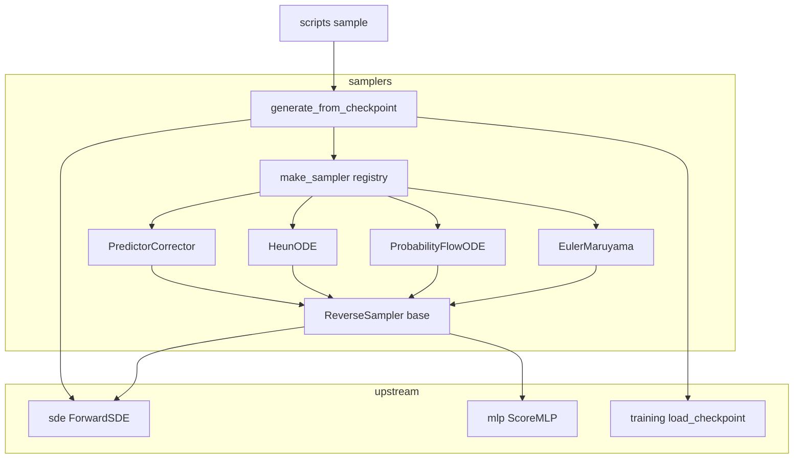
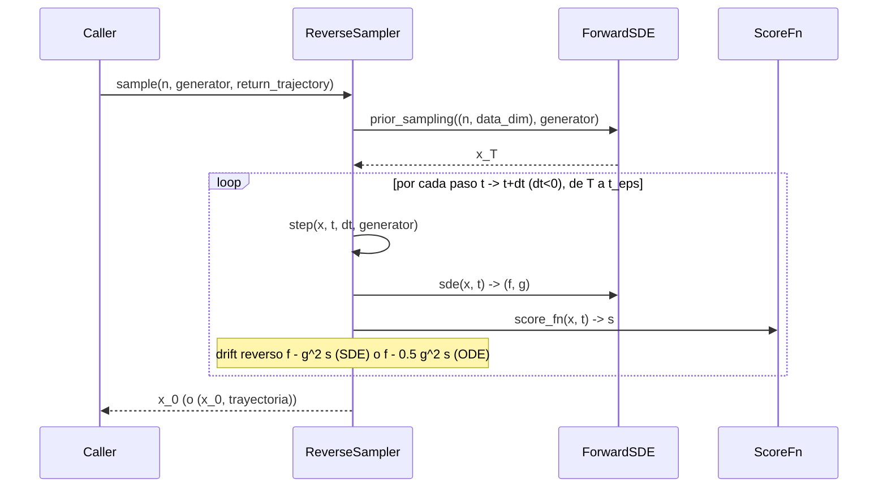

# Design Document — `samplers`

## Overview

**Purpose**: este feature entrega el **proceso reverso (Eje 2)** del estudio de difusión: el módulo
`diffusion.samplers`, que integra numéricamente la SDE/ODE inversa para generar muestras `x_0` a
partir de ruido, reusando el score aprendido `s_θ(x,t)`. Cierra el pipeline forward→score→**sampleo**.

**Users**: el autor del TP lo usa para producir las muestras de cada celda de la matriz de ablación
4×4 (4 SDEs × 4 samplers), variando únicamente el sampler sin reentrenar la red.

**Impact**: agrega un módulo nuevo, hermano de `sde`/`mlp`/`training`, que **consume** sus contratos
sin modificarlos. No toca código existente salvo, opcionalmente, un nuevo script CLI.

### Goals
- Implementar los cuatro samplers documentados (Euler–Maruyama, Probability-Flow ODE, Heun,
  predictor–corrector) sobre un driver de integración común.
- Mantener la red como variable de control: el sampler la consume como función pura `(x,t)→score`,
  sin mutarla ni reentrenarla; cambiar de sampler no reentrena.
- Permitir validar la corrección matemática de forma independiente del entrenamiento, inyectando un
  score analítico en forma cerrada.
- Ofrecer generación reproducible y config/checkpoint-driven por CLI.

### Non-Goals
- Dinámica reversa **validada** de CLD (estado aumentado): se deja como seam con guarda explícita.
- Visualización, ploteo y métricas (FID/IS): módulo de evaluación futuro.
- U-Net y Fase 2 de imágenes.
- Pesado HSM de la pérdida (vive en `training`/`sde`).

## Boundary Commitments

### This Spec Owns
- El paquete `diffusion.samplers`: el ABC `ReverseSampler` (grilla temporal, drifts reversos
  compartidos, driver `sample()`), los cuatro samplers concretos, y el registry/factory
  (`make_sampler`, `available_samplers`).
- El contrato `ScoreFn = Callable[[Tensor, Tensor], Tensor]` como única vía de inyección del score.
- La orquestación de generación desde checkpoint (`generate_from_checkpoint`) y su CLI
  (`scripts/sample.py`).
- La suite `tests/test_samplers.py` y la doc `docs/project/samplers.md`.

### Out of Boundary
- El entrenamiento del score y el pesado de la pérdida (incluido el HSM de CLD) — de `training`/`sde`.
- La definición de las SDEs y de la red — de `sde` y `mlp`.
- La dinámica reversa **validada** de CLD — diferida (la guarda rechaza SDEs aumentadas).
- Evaluación/visualización/métricas — módulo futuro.

### Allowed Dependencies
- `diffusion.sde`: `ForwardSDE.sde`, `prior_sampling`, `T`, `data_dim`, `is_augmented`, `make_sde`.
- `diffusion.mlp`: `ScoreMLP` (encaja como `ScoreFn`).
- `diffusion.training`: `load_checkpoint` y la metadata del checkpoint (solo lectura).
- `torch` (CPU), `numpy` para la salida `.npz`. **Sin** dependencias nuevas.
- Dirección de dependencias: `data_generation, sde, mlp, training → samplers`. Prohibido importar
  `samplers` desde esos módulos (no upward).

### Revalidation Triggers
- Cambia la firma de `ForwardSDE.sde`/`prior_sampling` o el shape de `(drift, diffusion)`.
- Cambia el formato del checkpoint o las claves de `meta` (`sde_name`, `data_dim`, `model`).
- Cambia la firma `forward(x,t)` de `ScoreMLP` (rompería el contrato `ScoreFn`).
- Se habilita CLD validado (cambiaría la guarda y el manejo de difusión estructurada).

## Architecture

### Existing Architecture Analysis
El proyecto sigue un layout layered por etapa del pipeline bajo `src/diffusion/<módulo>/`, cada uno
con **base ABC + variantes + registry/factory en `__init__`** y una suite `tests/test_<módulo>.py`.
`samplers` replica ese patrón exactamente (espeja `sde/`). Patrones preservados: factory con filtrado
de kwargs por `inspect.signature` (de `sde/__init__.py`), normalización temporal `_expand_t` y piso
`_std_eps` (de `sde/base.py`), reproducibilidad por `torch.Generator`, salidas `float32`.

### Architecture Pattern & Boundary Map



**Architecture Integration**:
- **Patrón**: Template Method. El ABC `ReverseSampler` fija el algoritmo de integración
  (`sample()`); cada sampler concreto sólo define `step()`. Justificación: los cuatro samplers son
  variaciones del mismo loop hacia atrás sobre una grilla temporal compartida.
- **Boundaries**: el núcleo de integración (base) está separado del paso por-sampler (variantes) y de
  la orquestación de IO/checkpoint (`generate`). Seams independientes y testeables en aislamiento.
- **Patrones preservados**: registry/factory, generator-driven RNG, `_expand_t`/`_std_eps`, `float32`.
- **Steering**: la red es variable de control y se consume como función pura; toda la estocasticidad
  vive en el sampler (EM/PC) o se anula (PF-ODE/Heun), nunca en la red.

### Technology Stack

| Layer | Choice / Version | Role in Feature | Notes |
|-------|------------------|-----------------|-------|
| CLI | Python `argparse` (stdlib) | `scripts/sample.py` wrapper fino | Sin YAML nuevo; checkpoint aporta la config del modelo. |
| Cómputo | `torch` 2.x CPU | Integración tensorial, RNG por `Generator` | Stack ya establecido. |
| Salida | `numpy` (`.npz`) | Persistir muestras y trayectoria | Igual que `data_generation`. |

## File Structure Plan

### Directory Structure
```
diffusion-models/src/diffusion/samplers/
├── __init__.py             # REGISTRY + make_sampler + available_samplers + generate_from_checkpoint + __all__
├── base.py                 # ScoreFn (type alias) + ReverseSampler (ABC): grilla, drifts reversos, sample(), step() abstracto
├── euler_maruyama.py       # EulerMaruyama (name "euler")        — paso SDE estocástico
├── pf_ode.py               # ProbabilityFlowODE (name "pf_ode")  — paso ODE determinístico
├── heun.py                 # HeunODE (name "heun")               — paso ODE 2º orden (2 evals)
├── predictor_corrector.py  # PredictorCorrector (name "pc")      — EM + K correcciones de Langevin
├── generate.py             # generate_from_checkpoint: load_checkpoint -> make_sde -> make_sampler -> sample -> .npz
└── __main__.py             # smoke test sobre el registry (red sin entrenar)

diffusion-models/tests/
└── test_samplers.py        # suite pytest (contrato, determinismo, factory, validación analítica, seams)

diffusion-models/scripts/
└── sample.py               # CLI argparse -> generate_from_checkpoint

docs/project/
└── samplers.md             # doc del módulo (español)
```

### Modified Files
- Ninguno obligatorio. (`docs/project/cronica.md` y `to-do.md` se actualizan por convención al
  entregar, fuera del código.)

> Cada archivo tiene una responsabilidad única; los samplers concretos dependen solo de `base.py`;
> `__init__`/`generate` dependen de las variantes y de los módulos upstream. Refleja exactamente el
> boundary: nada en este plan implica propiedad sobre entrenamiento, SDEs, red o evaluación.

## System Flows

### Flujo de sampleo (driver Template Method)



Decisiones de flujo: la grilla es **uniforme** de `T` a `t_eps` (`n_steps` intervalos); se integra en
tiempo decreciente (`dt<0`). El estado inicial `x_T` se sortea de `prior_sampling` salvo que el caller
pase `init`. PF-ODE/Heun ignoran `generator` (determinísticos); EM/PC lo consumen. PC ejecuta, tras el
predictor, `K` correcciones de Langevin al nivel de ruido `t+dt`.

## Requirements Traceability

| Requirement | Summary | Components | Interfaces | Flows |
|-------------|---------|------------|------------|-------|
| 1.1–1.5 | Generar `x_0` (shape/dtype/finitud), prior→`t_eps`, sin mutar red, trayectoria opcional | ReverseSampler | `sample()`, `_time_grid()` | Flujo de sampleo |
| 2.1 | Cuatro samplers ofrecidos | `__init__` REGISTRY | `available_samplers()` | — |
| 2.2 | EM estocástico | EulerMaruyama | `step()` | Flujo de sampleo |
| 2.3 | PF-ODE determinístico | ProbabilityFlowODE | `step()` | Flujo de sampleo |
| 2.4 | Heun 2º orden, 2 evals | HeunODE | `step()` | Flujo de sampleo |
| 2.5 | PC: SDE + K Langevin | PredictorCorrector | `step()` | Flujo de sampleo |
| 3.1–3.3 | Reuso del score sin reentrenar; `ScoreFn` callable; no muta la red | ReverseSampler, make_sampler | `ScoreFn`, `make_sampler()` | — |
| 4.1–4.4 | Factory por nombre, listado, error, filtrado de kwargs | `__init__` | `make_sampler()`, `available_samplers()` | — |
| 5.1–5.3 | Determinismo (PF-ODE/Heun) y reproducibilidad por semilla (EM/PC) | base + variantes | `sample()`, `step()` | Flujo de sampleo |
| 6.1–6.4 | Generación checkpoint-driven, guardado, trayectoria, errores | generate, CLI | `generate_from_checkpoint()` | — |
| 7.1–7.3 | Recuperar dist con score analítico; cobertura 4×3; seam de shapes | base + Testing Strategy | `ScoreFn` | Testing |
| 8.1–8.4 | `t` `(B,)`/`(B,1)`, estabilidad `t→0`, `float32`, `n_steps` configurable | ReverseSampler | `__init__`, helpers | — |

## Components and Interfaces

| Component | Domain/Layer | Intent | Req Coverage | Key Dependencies (P0/P1) | Contracts |
|-----------|--------------|--------|--------------|--------------------------|-----------|
| ReverseSampler | samplers/base | Driver de integración reversa + helpers compartidos | 1, 3, 5, 8 | ForwardSDE (P0), ScoreFn (P0) | Service, State |
| EulerMaruyama / ProbabilityFlowODE / HeunODE / PredictorCorrector | samplers/variants | Definen el `step()` de cada sampler | 2, 5 | ReverseSampler (P0) | Service |
| make_sampler / REGISTRY | samplers/`__init__` | Selección por nombre + filtrado de kwargs | 2.1, 3, 4 | variantes (P0) | Service |
| generate_from_checkpoint | samplers/generate | Orquesta carga de checkpoint → sampleo → `.npz` | 6 | load_checkpoint (P0), make_sde (P0), make_sampler (P0) | Service, Batch |

### samplers / base

#### ReverseSampler (ABC)

| Field | Detail |
|-------|--------|
| Intent | Fija el algoritmo de integración reversa; expone los drifts reversos; delega el paso a las subclases |
| Requirements | 1.1, 1.2, 1.3, 1.4, 1.5, 3.2, 3.3, 5.2, 8.1, 8.2, 8.3, 8.4 |

**Responsibilities & Constraints**
- Posee la grilla temporal, el muestreo del prior, el loop hacia atrás y la captura de trayectoria.
- Consume `score_fn` como función pura; ejecuta bajo `torch.no_grad()` y **no** altera parámetros de
  la red (3.3). Si `score_fn` es una `ScoreMLP`, se asume en modo `eval` (responsabilidad del caller;
  `generate_from_checkpoint` lo garantiza).
- Rechaza SDEs aumentadas (`sde.is_augmented is True`) con error claro: CLD fuera de alcance.
- `float32` consistente; `t` normalizado a `(B,1)` vía el patrón `_expand_t`; piso `t_eps` evita
  integrar hasta `t=0` exacto (8.2).

**Dependencies**
- Outbound: `ForwardSDE.sde`, `ForwardSDE.prior_sampling`, `ForwardSDE.T/data_dim/is_augmented` (P0).
- Outbound: `score_fn` (P0).

**Contracts**: Service [x] / State [x]

##### Service Interface
```python
from typing import Callable
import torch
from diffusion.sde import ForwardSDE

ScoreFn = Callable[[torch.Tensor, torch.Tensor], torch.Tensor]
# (x: (B, data_dim), t: (B,) | (B,1)) -> score: (B, data_dim)

class ReverseSampler(abc.ABC):
    name: str = ""  # clave del registry, p. ej. "euler"

    def __init__(
        self,
        sde: ForwardSDE,
        score_fn: ScoreFn,
        *,
        n_steps: int = 500,
        t_eps: float = 1e-3,
    ) -> None: ...

    def sample(
        self,
        n_samples: int,
        *,
        init: torch.Tensor | None = None,
        generator: torch.Generator | None = None,
        return_trajectory: bool = False,
    ) -> torch.Tensor | tuple[torch.Tensor, torch.Tensor]: ...
    # init: si se provee, se usa como x_T (shape (n_samples, data_dim)) en vez de sortear el prior;
    #       hace observable el determinismo del integrador aislado del muestreo del prior.
    # return: x_0 (n_samples, data_dim) float32;
    #         si return_trajectory: (x_0, traj) con traj (n_steps+1, n_samples, data_dim)

    def _time_grid(self) -> torch.Tensor: ...          # (n_steps+1,) de T a t_eps
    def _reverse_drift(self, x: torch.Tensor, t: torch.Tensor) -> torch.Tensor: ...   # f - g^2 s
    def _pfode_drift(self, x: torch.Tensor, t: torch.Tensor) -> torch.Tensor: ...     # f - 0.5 g^2 s

    @abc.abstractmethod
    def step(
        self, x: torch.Tensor, t: torch.Tensor, dt: float, *, generator: torch.Generator | None
    ) -> torch.Tensor: ...
```
- **Preconditions**: `n_steps >= 1`, `0 < t_eps < sde.T`, `sde.is_augmented is False`; si `init` se
  provee, su shape es `(n_samples, sde.data_dim)`.
- **Postconditions**: salida `float32`, shape `(n_samples, sde.data_dim)`, finita para VP/VE/sub-VP.
- **Invariants**: no modifica `sde` ni los parámetros de la red; con `init` fijo (o `generator`
  sembrado para el prior), un sampler determinístico produce salida idéntica.

##### State Management
- Estado de integración (`x`, índice de paso, trayectoria acumulada) es **local a `sample()`**; el
  sampler no guarda estado mutable entre llamadas. Concurrencia: instancias independientes, sin estado
  compartido.

**Implementation Notes**
- Integración: `_reverse_drift`/`_pfode_drift` derivan los coeficientes de `sde.sde(x,t)` (cuyo
  `diffusion` es `(B,1)`) y `score_fn(x,t)`. Reusa `_expand_t`-style para `t`.
- Validación: `step()` recibe `dt` negativo; las subclases no recalculan la grilla.
- Risks: el shape de `diffusion` difiere en CLD (`(B,data_dim)`); la guarda `is_augmented` evita el
  fallo silencioso. Mantener `no_grad` para no acumular gradientes innecesarios en CPU.

### samplers / variants (EulerMaruyama, ProbabilityFlowODE, HeunODE, PredictorCorrector)

| Field | Detail |
|-------|--------|
| Intent | Cada clase implementa solo `step()`, según la discretización documentada en `ejes.md` |
| Requirements | 2.2, 2.3, 2.4, 2.5, 5.1, 5.2, 5.3 |

**Contracts**: Service [x]

**Discretizaciones** (`d` = drift reverso o de PF-ODE según corresponda; `Z ~ N(0,I)`):
- `EulerMaruyama` (`"euler"`): `x + (f - g² s)·dt + g·√|dt|·Z`. Estocástico; usa `generator`.
- `ProbabilityFlowODE` (`"pf_ode"`): `x + (f - ½ g² s)·dt`. Determinístico; ignora `generator`.
- `HeunODE` (`"heun"`): predictor `x̂ = x + d(x,t)·dt`; corrector
  `x + ½[d(x,t) + d(x̂, t+dt)]·dt`, con `d = _pfode_drift`. Dos evaluaciones de score por paso.
- `PredictorCorrector` (`"pc"`): un paso de `EulerMaruyama` (predictor) seguido de `n_corrector`
  pasos de Langevin al nivel `t+dt`: `x ← x + ε·s + √(2ε)·Z`, con
  `ε = 2·(snr·‖Z‖ / ‖s‖)²` (norma L2 media por batch). Parámetros propios: `n_corrector: int = 1`,
  `snr: float = 0.16`.

**Implementation Notes**
- Integración: solo `PredictorCorrector` añade kwargs (`n_corrector`, `snr`) — el filtrado de
  `make_sampler` permite que un caller genérico pase siempre el mismo conjunto.
- Risks: `PredictorCorrector` puede divergir con `snr` mal elegido; el default `0.16` (Song et al.) y
  un piso en `‖s‖` mitigan; documentar como tunable.

### samplers / `__init__` (make_sampler, available_samplers)

| Field | Detail |
|-------|--------|
| Intent | Registry + factory por nombre con filtrado de kwargs por firma | 
| Requirements | 2.1, 3.1, 4.1, 4.2, 4.3, 4.4 |

##### Service Interface
```python
REGISTRY: dict[str, type[ReverseSampler]]  # {cls.name: cls}

def available_samplers() -> list[str]: ...  # nombres ordenados

def make_sampler(
    name: str, sde: ForwardSDE, score_fn: ScoreFn, **kwargs
) -> ReverseSampler: ...
# filtra kwargs por inspect.signature; ValueError con opciones si name desconocido
```
- **Errores**: `name` desconocido → `ValueError` enumerando `available_samplers()` (4.3); kwargs no
  aplicables descartados sin fallar (4.4).

### samplers / generate (generate_from_checkpoint)

| Field | Detail |
|-------|--------|
| Intent | Orquestar generación checkpoint-driven y persistencia | 
| Requirements | 6.1, 6.2, 6.3, 6.4 |

**Contracts**: Service [x] / Batch [x]

##### Service Interface
```python
def generate_from_checkpoint(
    checkpoint_path: str | pathlib.Path,
    sampler_name: str,
    *,
    n_samples: int,
    n_steps: int = 500,
    seed: int | None = None,
    out: str | pathlib.Path | None = None,
    save_trajectory: bool = False,
    map_location: str = "cpu",
    **sampler_kwargs,
) -> torch.Tensor: ...
```

##### Batch / Job Contract
- **Trigger**: invocación directa o vía `scripts/sample.py`.
- **Input/validation**: `checkpoint_path` debe existir y cargarse; de su `meta` se reconstruye
  `make_sde(meta["sde_name"], data_dim=meta["data_dim"])` y la red (ya en `eval`) (6.1).
- **Output/destination**: tensor de muestras; si `out` se provee, guarda `.npz` con `samples` (y
  `trajectory` si `save_trajectory`) (6.2, 6.3).
- **Idempotency & recovery**: dado `seed`, salida reproducible; si el checkpoint/ruta no existe o es
  inválido, falla rápido con error claro (6.4).

**Implementation Notes**
- Integración: pone la `ScoreMLP` en `eval()` y la pasa como `score_fn`; arma el sampler con
  `make_sampler`; consume `seed` creando un `torch.Generator`.
- Risks: si `meta` carece de claves esperadas → error claro (contrato con `training`).

## Error Handling

### Error Strategy
Fail-fast en los bordes; mensajes accionables que enumeran opciones válidas (consistente con
`make_sde`).

### Error Categories and Responses
- **Input inválido**: `name` de sampler desconocido → `ValueError` con la lista de opciones (4.3);
  `n_steps < 1` o `t_eps` fuera de `(0, T)` → `ValueError`.
- **No soportado**: `sde.is_augmented` (CLD) → `NotImplementedError`/`ValueError` indicando que CLD
  está fuera de alcance de esta iteración.
- **IO/checkpoint**: ruta inexistente o checkpoint/`meta` inválido → error claro en
  `generate_from_checkpoint` (6.4).

### Monitoring
No aplica monitoreo de runtime; la observabilidad es la suite de pytest y el smoke test `__main__`.

## Testing Strategy

Derivada de los criterios de aceptación; `pytest.importorskip("torch")`, parametrizado sobre
`["euler","pf_ode","heun","pc"]` × `["vp","ve","sub_vp"]`.

### Unit Tests
- **Factory/registry** (4.1–4.4): `available_samplers()` == set esperado; `make_sampler` devuelve el
  tipo correcto; nombre desconocido → `ValueError`; `pc` acepta `snr`/`n_corrector` y los demás los
  descartan sin fallar.
- **Contrato de `sample`** (1.1, 1.4, 8.3): shape `(N, data_dim)`, `dtype float32`, `isfinite`.
- **Grilla y trayectoria** (1.2, 1.5, 8.4): `_time_grid()` arranca en `T` y termina en `t_eps` con
  `n_steps+1` puntos; `return_trajectory=True` devuelve `(n_steps+1, N, data_dim)`.
- **Interfaz temporal** (8.1): `t` como `(B,)` y `(B,1)` dan el mismo resultado en los helpers.
- **Red intacta** (3.3): los parámetros de una `ScoreMLP` no cambian tras `sample()`.

### Integration / Determinism Tests
- **Determinismo** (5.1): PF-ODE y Heun dos veces con el mismo `init` fijo → `torch.equal` (aísla el
  integrador del muestreo del prior).
- **Reproducibilidad** (5.2, 5.3): EM y PC con el mismo `generator` sembrado → idénticos; con semillas
  distintas → distintos.
- **Seam end-to-end** (7.3): `make_sde` + `ScoreMLP` + `make_sampler` → shapes coherentes en toda la
  cadena (incluye `data_dim` variable).
- **Generación checkpoint-driven** (6.1–6.4): construir el checkpoint con `save_checkpoint` sobre una
  `ScoreMLP` **sin entrenar** (sin invocar `train`, para mantener el test rápido y centrado en el
  contrato de IO/orquestación), generar vía `generate_from_checkpoint`, verificar shape y archivo
  `.npz`; ruta inexistente → error claro.

### Correctness Test (clave, 7.1)
- Con un **score analítico** de un target gaussiano conocido `x_0 ~ N(μ, Σ_0)`: bajo VP/VE/sub-VP la
  marginal `p_t` es gaussiana con `(mean_t, Σ_t)` derivables de `sde.marginal_prob`, y el score es
  `s(x,t) = -Σ_t⁻¹ (x - μ_t)`. Inyectando ese `ScoreFn`, el sampler debe **recuperar** `N(μ, Σ_0)`:
  comparar media y covarianza de las muestras con tolerancia Monte Carlo (`N` grande, `n_steps`
  suficientes; `generator` sembrado o `init` fijo para reproducibilidad). Cubre cada sampler;
  PF-ODE/Heun como referencia determinística.
- Cobertura 4×3 (7.2): el parametrizado asegura los cuatro samplers sobre las tres SDEs escalares.

## Open Questions / Risks
- **Defaults de PC** (`snr=0.16`, `n_corrector=1`): tomados de Song et al.; pueden requerir ajuste por
  dataset. Tunables vía kwargs.
- **`t_eps` y `n_steps` de validación**: elegir valores que hagan el test de 7.1 estable y rápido en
  CPU (decisión de implementación dentro del rango documentado).
- **Grilla uniforme**: suficiente para esta iteración; un espaciado geométrico para VE queda como
  posible refinamiento futuro (fuera de alcance).
