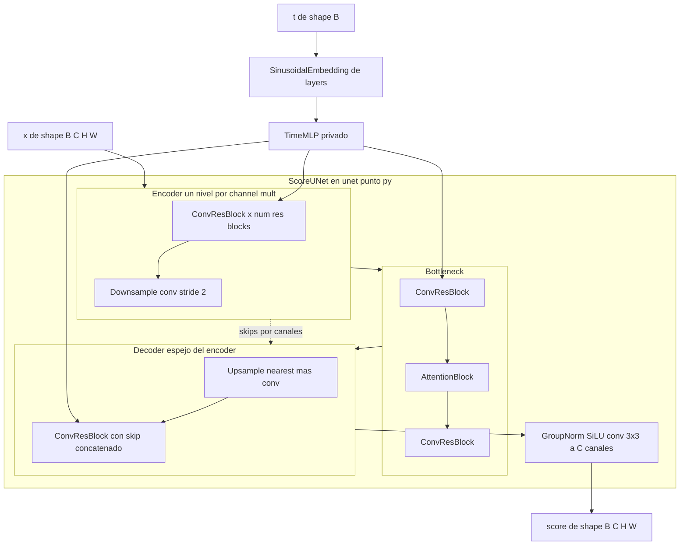

# Diseño Técnico — score-unet

## Overview

**Purpose**: esta feature entrega la `ScoreUNet`, la red de score convolucional para imágenes que
habilita la Fase 2 del estudio de ablación, como segunda red del módulo `diffusion.models` junto a
la `ScoreMLP` de Fase 1.

**Users**: el autor del TP la usará como **variable de control** de la matriz 3×4 sobre imágenes:
una vez fijada la arquitectura de referencia (los defaults del constructor), queda idéntica en las
12 celdas y toda la estocasticidad vive fuera de la red.

**Impact**: agrega `models/unet.py` (archivo nuevo autocontenido) y el re-export en
`models/__init__.py`. No modifica ningún módulo terminado (`sde`, `samplers`, `training`,
`data_generation`) ni las piezas compartidas de `models/layers.py`. Actualiza la documentación de
alcance que aún dice "U-Net de librería".

### Goals

- Red `(x: (B, C, H, W), t: (B,)) -> score: (B, C, H, W)` enteramente determinística, verificada
  en CPU (suite de pytest + smoke `python -m diffusion.models.unet`).
- Soporte de los tamaños candidatos de Fase 2: `C ∈ {1, 3}` verificados, resoluciones 32×32 y
  64×64, con validación fail-fast de resoluciones incompatibles.
- Arquitectura de referencia fijada por defaults del constructor (sin números mágicos), con
  atención en 16×16 según el brief.
- Documentación actualizada: `models.md` (la red) y `ejes.md`/`CLAUDE.md`/steering `product.md`
  (decisión "U-Net a mano", 05/07/2026).

### Non-Goals

- Generalizar `sde`/`samplers` a tensores imagen (broadcast `(B, 1)` y prior `(N, data_dim)`
  actuales quedan como están).
- Desacoplar `training` de `ScoreMLP` (construcción, `TrainConfig`, checkpoints).
- Factory/registry `make_model` (diferido a la spec de training; ver `research.md`).
- Dataset de Fase 2, pipeline de datos, flip horizontal, EMA, FID/IS, corridas GPU.
- Trucos de estabilidad de entrenamiento (p. ej. zero-init del conv final: descartado porque una
  red recién instanciada devolvería la constante 0 y rompería los criterios 1.4/1.5).

## Boundary Commitments

### This Spec Owns

- El archivo `diffusion-models/src/diffusion/models/unet.py` completo: la clase pública
  `ScoreUNet` y sus bloques privados (proyección de tiempo, bloque residual convolucional,
  atención, down/upsampling).
- El re-export de `ScoreUNet` en `models/__init__.py` (docstring y `__all__`).
- Los tests nuevos de la red dentro de `tests/test_models.py`.
- La sección U-Net de `docs/project/models.md` y la corrección de alcance en
  `docs/project/ejes.md`, `.claude/CLAUDE.md` y `.kiro/steering/product.md`.

### Out of Boundary

- Cualquier cambio de comportamiento en `models/layers.py`, `models/mlp.py`, `models/base.py`
  (solo se consumen).
- Los módulos `sde`, `samplers`, `training`, `data_generation` y sus tests existentes.
- La decisión de introducir `make_model` y la carga/guardado de checkpoints de la U-Net.

### Allowed Dependencies

- `torch` / `torch.nn` / `torch.nn.functional` (dependencia dura ya existente; ninguna dependencia
  nueva).
- `models.layers`: `SinusoidalEmbedding` y `_make_activation` (las únicas importaciones
  intra-paquete permitidas en `unet.py`).
- Dirección de dependencias del módulo: `layers.py → {mlp.py, unet.py} → __init__.py`. `unet.py`
  **no** importa `mlp.py`, `base.py` ni módulos hermanos (`sde`, `training`, `samplers`). Los tests
  sí usan `base.ScoreModel` para verificar el contrato.

### Revalidation Triggers

- Cambio de la firma `forward(x, t)` o de la semántica "salida con la misma shape que `x`"
  (contrato `ScoreModel`) → re-validar specs futuras de training/generalización.
- Cambio de las piezas compartidas de `layers.py` → re-validar `ScoreMLP` y `ScoreUNet` juntas.
- Promoción de un bloque privado de `unet.py` a `layers.py` → re-validar la regla de admisión
  (≥ 2 consumidores idénticos).
- Cambio de los defaults del constructor una vez iniciado el estudio → invalida la comparabilidad
  entre celdas (regla de oro de `experiment-matrix.md`); requiere decisión explícita del autor.

## Architecture

### Existing Architecture Analysis

- El módulo `models` ya separa compartido (`layers.py`) de red-específico (`mlp.py`) y explicita el
  contrato en `base.ScoreModel` (Protocol estructural, `runtime_checkable`).
- Patrones a espejar de `mlp.py`: hiperparámetros como argumentos del constructor con defaults,
  proyección final sin activación, docstrings en español con la retórica de variable de control,
  bloque `__main__` de smoke (ejecutable solo vía `-m` por los imports relativos).
- Convenciones de steering vigentes: red determinística (`tech.md`), `float32` y `t` en `(B,)` o
  `(B, 1)` (`numerics.md`), tests con `importorskip("torch")` y suite por módulo (`testing.md`).
- No existe código convolucional previo en el repo: los bloques de la U-Net no tienen restricciones
  heredadas más allá de las convenciones anteriores.

### Architecture Pattern & Boundary Map

Patrón elegido: **U-Net estilo DDPM** (encoder–bottleneck–decoder con skips y condicionamiento
temporal aditivo por bloque), versión reducida para el TP. Rationale: es la arquitectura de las
referencias ancla del trabajo (Ho et al. 2020; Song et al. 2021) y la que el brief describe.



**Key Decisions** (evidencia y alternativas en `research.md`):

- Atención = QKV por conv 1×1 + `F.scaled_dot_product_attention` (single-head): disponible y
  bitwise-determinística en torch 2.12 CPU (probado). Colocación **en construcción** a partir de
  `image_size`: se instancia en los niveles cuya resolución pertenece a `attn_resolutions`
  (default `(16,)`) y siempre en el bottleneck. Con `image_size=64` o `32`, la misma config
  `(16,)` cumple "atención en 16×16" — una instancia por resolución (2.2 se satisface por
  configuración; decisión de validate-design, 06/07/2026).
- Downsample = conv 3×3 stride 2; upsample = nearest ×2 + conv 3×3 (determinísticos,
  anti-checkerboard).
- Inyección temporal: `TimeMLP` proyecta el embedding sinusoidal a `time_embed_dim`; cada
  `ConvResBlock` lo re-proyecta a sus canales y lo suma tras la primera conv (broadcast
  `(B, C_out, 1, 1)`).
- Normalización = `nn.GroupNorm` (determinística, independiente del batch — criterio 3.3 con
  tolerancia `allclose(atol=1e-6)`, justificada empíricamente en `research.md`).
- Sin dropout, sin batchnorm, sin zero-init final (ver Non-Goals).

### Technology Stack

| Layer | Choice / Version | Role in Feature | Notes |
|-------|------------------|-----------------|-------|
| Cómputo | `torch 2.12.0+cpu` (ya en el lock) | red, bloques, atención SDPA | sin dependencias nuevas |
| Compartido interno | `models.layers` | embedding de tiempo + activaciones | reuso sin modificar |
| Tests | `pytest` (suite del repo) | verificación CPU | `importorskip` convención |

## File Structure Plan

### Directory Structure

```
diffusion-models/
├── src/diffusion/models/
│   ├── unet.py            # NUEVO: TimeMLP, ConvResBlock, AttentionBlock, Downsample,
│   │                      #   Upsample (privados) + ScoreUNet (pública) + smoke __main__
│   └── __init__.py        # MODIFICADO: re-export ScoreUNet, __all__, docstring del módulo
└── tests/
    └── test_models.py     # MODIFICADO: sección nueva de tests de ScoreUNet (config tiny)
```

### Modified Files (documentación, criterios 6.1–6.3)

- `docs/project/models.md` — sección de la `ScoreUNet` (contrato, piezas, arquitectura de
  referencia, smoke) + actualización del árbol de archivos y de la nota de mitigación de
  memorización (flip + EMA fuera de la red).
- `docs/project/ejes.md` — Fase 2 pasa de "U-Net de librería" a "U-Net propia" (decisión
  05/07/2026).
- `.claude/CLAUDE.md` — mismas menciones ("La U-Net no se diseña: se reutiliza una existente",
  módulo `models`, sección "Todavía no implementado").
- `.kiro/steering/product.md` — bullet de Fase 2 ("reusando una U-Net de librería").

## Requirements Traceability

| Requirement | Summary | Components | Interfaces | Flows |
|-------------|---------|------------|------------|-------|
| 1.1 | forward `(B,C,H,W)+(B,)→(B,C,H,W)` float32 | ScoreUNet | `forward` | diagrama |
| 1.2 | `t` como `(B,)` o `(B,1)` | ScoreUNet, SinusoidalEmbedding (reuso) | `forward` | — |
| 1.3 | salidas finitas, escalas de `t` libres | ScoreUNet, TimeMLP | `forward` | — |
| 1.4 | condicionamiento temporal efectivo | ConvResBlock (inyección aditiva) | `forward` | — |
| 1.5 | salida no acotada | ScoreUNet (salida sin activación final) | `forward` | — |
| 1.6 | satisface `ScoreModel` | ScoreUNet (estructural, sin herencia) | Protocol | — |
| 2.1 | `C` configurable (1 y 3) | ScoreUNet (`in_channels`) | `__init__` | — |
| 2.2 | resoluciones 32 y 64 | ScoreUNet (`image_size`, `attn_resolutions`) | `__init__` (por configuración) | — |
| 2.3 | `ValueError` por resolución incompatible | ScoreUNet (`__init__`: divisibilidad; `forward`: tamaño exacto) | `__init__`/`forward` | — |
| 3.1 | mismo `(x,t)` → salida idéntica | ScoreUNet (sin fuentes de azar) | `forward` | — |
| 3.2 | sin dropout/batchnorm | todos los bloques | inspección `.modules()` | — |
| 3.3 | independencia del batch | GroupNorm en bloques | `forward` (allclose 1e-6) | — |
| 3.4 | gradientes finitos | ScoreUNet | backward | — |
| 4.1 | defaults = arquitectura de referencia | ScoreUNet | `__init__` | — |
| 4.2 | conteo de parámetros reproducible | ScoreUNet | `parameters()` | — |
| 4.3 | activación desconocida → `ValueError` | `_make_activation` (reuso) | `__init__` | — |
| 5.1 | smoke `-m` con `(2, 3, 64, 64)` | bloque `__main__` de unet.py | CLI `-m` | — |
| 5.2 | suite CPU rápida | tests con config tiny | pytest | — |
| 5.3 | skip sin torch | convención `importorskip` | pytest | — |
| 5.4 | suite del repo en verde | sin cambios a módulos existentes | pytest | — |
| 6.1 | doc del módulo | `docs/project/models.md` | — | — |
| 6.2 | docs de alcance actualizados | `ejes.md`, `CLAUDE.md`, `product.md` | — | — |
| 6.3 | mitigación fuera de la red documentada | `models.md` (nota) | — | — |

## Components and Interfaces

| Component | Domain/Layer | Intent | Req Coverage | Key Dependencies | Contracts |
|-----------|--------------|--------|--------------|------------------|-----------|
| ScoreUNet | models (pública) | red de score para imágenes | 1.1–1.6, 2.1–2.3, 3.1–3.4, 4.1–4.3 | layers (P0), torch (P0) | Service |
| TimeMLP | unet.py (privada) | proyectar embedding de tiempo | 1.3, 1.4 | SinusoidalEmbedding (P0) | — |
| ConvResBlock | unet.py (privada) | bloque residual conv + tiempo | 1.4, 3.2, 3.3 | GroupNorm, TimeMLP out (P0) | — |
| AttentionBlock | unet.py (privada) | self-attention espacial | 2.2, 3.1 | SDPA (P0) | — |
| Downsample / Upsample | unet.py (privadas) | cambio de resolución ×2 | 2.2, 2.3 | torch (P0) | — |
| models `__init__` | models | re-export público | 1.6, 5.4 | unet.py (P0) | — |
| smoke `__main__` | unet.py | verificación manual CPU | 5.1 | ScoreUNet (P0) | Batch |

### models (pública)

#### ScoreUNet

| Field | Detail |
|-------|--------|
| Intent | Red de score convolucional determinística para imágenes; variable de control de Fase 2 |
| Requirements | 1.1, 1.2, 1.3, 1.4, 1.5, 1.6, 2.1, 2.2, 2.3, 3.1, 3.2, 3.3, 3.4, 4.1, 4.2, 4.3 |

**Responsibilities & Constraints**

- Ensambla encoder–bottleneck–decoder con skips por concatenación de canales; expone únicamente
  `__init__` y `forward`.
- Enteramente determinística: sin dropout, batchnorm ni muestreo interno (invariante verificado
  por tests recorriendo `.modules()`).
- No posee estado entre llamadas más allá de sus parámetros; no conoce SDEs, samplers ni datasets.

**Dependencies**

- Outbound: `models.layers.SinusoidalEmbedding` — embedding de `t` (P0);
  `models.layers._make_activation` — activaciones con `ValueError` uniforme (P0).
- External: `torch.nn` (GroupNorm, Conv2d), `torch.nn.functional.scaled_dot_product_attention` (P0).

**Contracts**: Service [x]

##### Service Interface

```python
class ScoreUNet(nn.Module):
    def __init__(
        self,
        in_channels: int = 3,
        image_size: int = 64,          # resolución de trabajo; fija la colocación de la atención
        base_channels: int = 64,
        channel_mults: tuple[int, ...] = (1, 2, 2, 4),
        num_res_blocks: int = 2,
        embed_dim: int = 128,          # dim del SinusoidalEmbedding (par)
        time_embed_dim: int = 256,     # dim de la proyección TimeMLP (4x base, convención DDPM)
        attn_resolutions: tuple[int, ...] = (16,),
        groups: int = 8,               # GroupNorm; debe dividir a todos los anchos
        activation: str = "silu",
    ) -> None: ...

    def forward(self, x: torch.Tensor, t: torch.Tensor) -> torch.Tensor: ...
```

- **Preconditions** (`__init__`): `image_size` divisible por `2 ** (len(channel_mults) - 1)` (si
  no, `ValueError` indicando el múltiplo requerido); `base_channels * m % groups == 0` para todo
  `m` de `channel_mults` (si no, `ValueError` nombrando el nivel infractor); `activation` conocida
  (si no, `ValueError` vía `_make_activation`); `embed_dim` par (si no, `ValueError` vía
  `SinusoidalEmbedding`). La atención se coloca **en construcción**: en los niveles cuya
  resolución (derivada de `image_size`) pertenece a `attn_resolutions`, más el bottleneck.
- **Preconditions** (`forward`): `x` de shape `(B, in_channels, H, W)` con
  `H == W == image_size` (si no, `ValueError` con esperado vs recibido — la arquitectura efectiva
  quedó fijada por `image_size` en construcción); `x.shape[1] == in_channels` (si no,
  `ValueError`); `t` de shape `(B,)` o `(B, 1)`.
- **Postconditions**: salida de shape y dtype idénticos a `x` (`float32` para entrada `float32`);
  valores finitos para entradas finitas; sin activación final (rango no acotado); mismo `(x, t)`
  en eval → salida bitwise idéntica.
- **Invariants**: dos instancias con los mismos argumentos tienen el mismo conteo de parámetros;
  la arquitectura de los defaults es la **de referencia** del estudio y no se altera entre celdas.

**Implementation Notes**

- Integration: se re-exporta en `models/__init__.py` (`__all__ += ["ScoreUNet"]`); satisface
  `models.base.ScoreModel` estructuralmente (sin importar `base.py`).
- Validation: smoke `__main__` con `x = torch.randn(2, 3, 64, 64)` reporta shape y parámetros
  (criterio 5.1); la suite usa config tiny (ver Testing Strategy).
- Risks: contabilidad de canales del decoder (skips concatenados) — mitigada con tests de forward
  completo en {32, 64} × {C=1, C=3} sobre config tiny.

### unet.py (bloques privados — resumen)

Bloques internos sin contrato público; sus responsabilidades quedan fijadas para guiar la
implementación y la revisión:

- **TimeMLP**: `SinusoidalEmbedding(embed_dim)` → `Linear(embed_dim, time_embed_dim)` → activación
  → `Linear(time_embed_dim, time_embed_dim)`. Salida `(B, time_embed_dim)` compartida por todos los
  bloques del forward. Acepta `t` en `(B,)`/`(B, 1)` (lo normaliza el embedding reusado).
- **ConvResBlock**: `GroupNorm → act → Conv3×3` + suma de la proyección temporal
  (`Linear(time_embed_dim, C_out)` → `(B, C_out, 1, 1)`) + `GroupNorm → act → Conv3×3`; skip
  identidad si `C_in == C_out`, si no conv 1×1. Análogo convolucional del `ResidualBlock` lineal
  del MLP (comparten la idea, no el código — regla de `layers.py`).
- **AttentionBlock**: `GroupNorm` → proyecciones QKV por conv 1×1 → SDPA single-head sobre los
  `H·W` tokens → conv 1×1 de salida + residual.
- **Downsample**: conv 3×3 stride 2. **Upsample**: nearest ×2 + conv 3×3.

## Error Handling

Estrategia fail-fast con `ValueError` y mensajes en español que nombran el argumento y la
restricción (patrón de `layers.py`/`SinusoidalEmbedding`):

| Condición | Dónde | Error |
|-----------|-------|-------|
| `activation` desconocida | `__init__` (vía `_make_activation`) | `ValueError` con opciones válidas (4.3) |
| `groups` no divide algún ancho de canal | `__init__` | `ValueError` nombrando nivel y ancho |
| `embed_dim` impar | `__init__` (vía `SinusoidalEmbedding`) | `ValueError` existente |
| `image_size` no divisible por `2**(L-1)` | `__init__` | `ValueError` con múltiplo requerido (2.3) |
| `H`/`W` de `x` ≠ `image_size` | `forward` | `ValueError` con esperado vs recibido (2.3) |
| canales de `x` ≠ `in_channels` | `forward` | `ValueError` con esperado vs recibido |

No hay degradación graceful: la red es una función pura; toda entrada inválida corta temprano.

## Testing Strategy

Config tiny para la suite (evidencia de timing en `research.md`: ~9 ms/forward):
`image_size=32, base_channels=8, channel_mults=(1, 2), num_res_blocks=1, embed_dim=8,
time_embed_dim=16, groups=4, attn_resolutions=(16,)` — el nivel 16×16 ejercita la atención.
**Una instancia por resolución**: los tests parametrizados por resolución construyen la red con el
`image_size` correspondiente.

### Unit Tests (en `tests/test_models.py`, sección ScoreUNet)

- Contrato de shape: forward `(B, C, H, W) → (B, C, H, W)` en `float32`, parametrizado
  `C ∈ {1, 3}` × `image_size ∈ {32, 64}` (config tiny con el `image_size` respectivo; 1.1, 2.1,
  2.2).
- `t` como `(B,)` y `(B, 1)` → resultados idénticos; escalas `[0, 1]`, `[0, 1000]`, pasos enteros
  → salidas finitas (1.2, 1.3).
- Condicionamiento efectivo: mismo `x`, dos `t` distintos → salidas distintas (1.4); salida con
  valores de ambos signos sobre entrada aleatoria (1.5); `isinstance(net, ScoreModel)` (1.6).
- Determinismo: mismo `(x, t)` dos veces en eval → `torch.equal` (3.1); sin
  `Dropout`/`BatchNorm*` recorriendo `.modules()` (3.2); muestra sola vs en batch →
  `torch.allclose(atol=1e-6)` (3.3); backward → gradientes finitos en todos los parámetros (3.4).
- Configuración: dos instancias con mismos argumentos → mismo conteo de parámetros (4.1, 4.2);
  `ValueError` para activación desconocida, `groups` incompatible, `image_size` no divisible y
  `H/W` de `x` distintos de `image_size` (2.3, 4.3).
- **Arquitectura de referencia (único test con defaults)**: construcción con defaults + un forward
  `(1, 3, 64, 64)` + verificación de shape (~100–200 ms; cubre el camino completo de 4 niveles con
  mult 4 bajo pytest; 4.1, 5.4 — decisión de validate-design).

### Integration Tests

- Suite completa del repo en verde tras integrar (242 tests existentes + nuevos; 5.4).
- Smoke `python -m diffusion.models.unet` corre con defaults y reporta `(2, 3, 64, 64)` + conteo
  de parámetros (5.1); convención `importorskip` al tope de la suite (5.3).

### Performance

- Presupuesto: los tests de la U-Net agregan ≲ 5 s a la suite (config tiny; 5.2). El smoke con
  defaults queda en el orden de los cientos de ms por forward (probe: ~116 ms un stack comparable).
