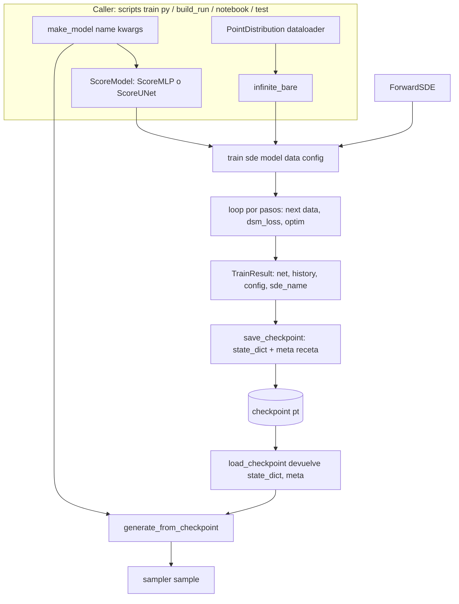
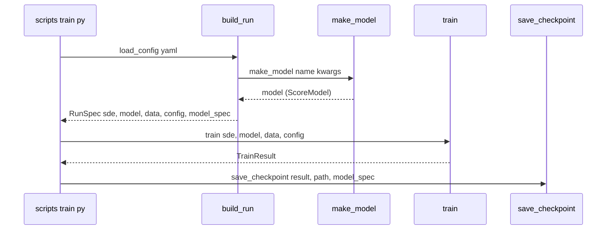

# Diseño Técnico — train-decoupling

## Overview

**Purpose**: convertir `diffusion.training.train()` en un loop de entrenamiento **agnóstico a la red
y al origen de datos**, de modo que la misma función entrene el `ScoreMLP` de Fase 1 y la `ScoreUNet`
de Fase 2 sin ramificar por tipo. Es el desacople que la spec `score-unet` dejó anotado como
pendiente.

**Users**: el autor del TP, que hoy no puede entrenar la U-Net porque `train()` construye un
`ScoreMLP` hardcodeado y consume un `distribution` finito por épocas.

**Impact**: `train()` pasa a recibir `(sde, model, data, config)`; el loop pasa de épocas a **pasos**;
`TrainConfig` se acota a los campos del loop; se agrega el adaptador `infinite_bare` en
`data_generation` y el registry `make_model` en `models`; el contrato de checkpoint se vuelve
**model-agnóstico con receta genérica** (R5-c). El ripple —config-driven, `scripts/train.py`,
`training/__main__.py`, `samplers/generate.py` y las suites— se actualiza para quedar en verde sin
regresiones.

### Goals

- `train(sde, model, data, config, *, generator=None)` usa la `model` recibida (`ScoreModel`) sin
  construir red ni ramificar por tipo; loop `for step in range(config.num_steps)` sobre un iterador
  infinito de tensores crudos; `history` por intervalo de logging.
- `TrainConfig` = solo campos del loop (`num_steps, lr, grad_clip, t_eps, device, seed, log_every`).
- Adaptador `infinite_bare` en `data_generation`; registry `make_model` en `models`.
- Checkpoints model-agnósticos (R5-c): `load_checkpoint -> (state_dict, meta)`, `meta` con receta
  genérica `model={name, kwargs}`; `generate_from_checkpoint` reconstruye vía `make_model` (o `model=`
  explícito) — el sample CLI sigue andando sin args de modelo.
- Config-driven actualizado (`build_run`/`RunSpec`/`scripts/train.py`), `__main__`, doc `training.md`.
- Suite completa en verde en cada paso; pérdida del MLP en swiss roll **baja** (tendencia).

### Non-Goals

- Pipeline de datos de **imágenes** (`infinite_batches`, dataset a definir) — spec futura.
- **EMA** de pesos — paso posterior.
- Cambios a `ScoreMLP`/`ScoreUNet`/`layers`/`sde`/`dsm_loss`/`sample_timesteps` **más allá de
  imports/tipos**. (Única excepción additiva: `make_model` en `models/__init__.py`, sin tocar las
  redes — ver Boundary Commitments.)
- Un método `get_config()` en el Protocol `ScoreModel` (la receta la aporta el caller/config-driven).

## Boundary Commitments

### This Spec Owns
- `training/trainer.py`: `train` (firma + loop por pasos), `TrainConfig` (acotado), `TrainResult`
  (tipo `ScoreModel`), `save_checkpoint`/`load_checkpoint` (contrato R5-c).
- `training/config.py`: `build_run`/`RunSpec` (construyen modelo + data iter; llevan `model`+`data`).
- `data_generation`: adaptador `infinite_bare` (+ export).
- `models`: **solo** el registry additivo `make_model`/`available_models`/`REGISTRY` en
  `models/__init__.py` (registra `mlp`→ScoreMLP, `unet`→ScoreUNet). **No** cambia las redes.
- `scripts/train.py`, `training/__main__.py`: adaptación a la firma nueva.
- `samplers/generate.py`: adaptación al contrato de checkpoint R5-c (reconstruye la red vía receta o
  `model=`), sin romper la generación.
- Suites afectadas (`test_training.py`, `test_samplers.py`, y el test del adaptador en
  `test_data_generation.py` si aplica) y doc `docs/project/training.md`.

### Out of Boundary
- `infinite_batches` / dataset de imágenes; EMA; evaluación/visualización de Fase 1.
- El cuerpo de `ScoreMLP`/`ScoreUNet`/`layers`, y la matemática de `sde`/`dsm_loss`/`sample_timesteps`
  (se preservan idénticos).

### Allowed Dependencies
- `training` → `models` (`ScoreModel`, `make_model`), `sde` (`ForwardSDE`, `make_sde`),
  `data_generation` (`infinite_bare`, `PointDistribution`), `losses` (`dsm_loss`, `sample_timesteps`),
  `torch`. Sin dependencias nuevas.
- `samplers/generate.py` → `training.load_checkpoint` + `models.make_model` (para reconstruir).
- Dirección: `data_generation, models, sde, losses → training → {scripts, __main__}`; `training,
  models → samplers`. Prohibido importar `samplers`/`training` "hacia arriba".

### Revalidation Triggers
- Cambia la firma pública de `train`/`TrainConfig`/`TrainResult` → re-checar `scripts`, `__main__`,
  config-driven y specs futuras (imágenes).
- Cambia el contrato de checkpoint (`load_checkpoint` return, claves de `meta`, receta `model`) →
  **dispara el revalidation trigger declarado en `samplers/design.md:57`**: re-verificar
  `samplers/generate.py` + `scripts/sample.py` + sus tests. (Esta spec ya lo hace.)
- Cambia la firma del contrato `ScoreModel` `(x, t) -> score` → re-checar `make_model` y ambas redes.

## Architecture

### Existing Architecture Analysis
- El repo usa **base abstracta + variantes + registry/factory** por paquete: `make_sde`
  (`sde/__init__`), `make_distribution` (`data_generation/__init__`). `make_model` sigue ese patrón
  en `models/__init__` (ver `structure.md`).
- `train` hoy acopla construcción de red (`trainer.py:96-102`) y loader finito (`:105`) con el loop;
  el checkpoint (`:138-194`) codifica la receta de `ScoreMLP` en `meta["model"]` y `load_checkpoint`
  reconstruye la red. `samplers/generate.py:87` consume ese `(net, meta)`.
- `dsm_loss`/`sample_timesteps`/optim/grad-clip/seed-generator son agnósticos y **no cambian**.

### Architecture Pattern & Boundary Map

Patrón: **inyección de dependencias** — el caller construye la red y la fuente de datos; `train` solo
orquesta el loop. La construcción por nombre se centraliza en un **registry** (`make_model`).



**Key Decisions** (detalle y alternativas en `research.md`):
- `train` agnóstico: `net = model.to(device)` idempotente; nunca importa `ScoreMLP`/`ScoreUNet`.
- Loop por pasos: `data_iter = iter(data)`, `for step in range(num_steps): x0 = next(data_iter)...`;
  `history` por intervalo de logging.
- `make_model` registry additivo en `models` (dos consumidores: `build_run`, `generate_from_checkpoint`).
- Checkpoint R5-c: `state_dict` + `meta{sde_name, data_dim, model:{name,kwargs}?, history}`; la receta
  `model` la aporta el caller (`save_checkpoint(..., model_spec=...)`), transportada por `RunSpec` en
  el camino config-driven; sin receta el checkpoint es válido pero requiere `model=` al generar.
- `infinite_bare(loader)`: generador puro que recorre el loader en bucle y yield-ea el tensor crudo.

### Technology Stack

| Layer | Choice / Version | Role | Notes |
|-------|------------------|------|-------|
| Cómputo | `torch 2.12.0+cpu` | loop, optim, checkpoints | sin dependencias nuevas |
| Config | `pyyaml` (ya presente) | YAML → `build_run` | esquema recalibrado |
| Tests | `pytest` | suites del repo | `importorskip("torch")` |

## File Structure Plan

### Modified Files
- `diffusion-models/src/diffusion/training/trainer.py` — `TrainConfig` (quita 7 campos, agrega
  `num_steps`); `TrainResult.net: ScoreModel`; `train(sde, model, data, config, *, generator)` (loop
  por pasos, sin construir red, sin loader); `save_checkpoint(result, path, *, model_spec=None)`
  (state_dict + meta con receta opcional); `load_checkpoint(path, *, map_location) -> (state_dict,
  meta)`. Quita el import de `ScoreMLP`.
- `diffusion-models/src/diffusion/training/config.py` — `RunSpec` lleva `model` + `data` (en vez de
  `distribution`); `build_run` construye la red vía `make_model` (bloque `model:`) y la fuente de
  datos (`dataloader` envuelto en `infinite_bare`), y transporta `model_spec` para el checkpoint;
  recalibra la validación de claves (los campos de red ya no van a `TrainConfig`). **El bloque
  `model:` es opcional** (decisión validate-design, issue 3): si falta, `build_run` usa por defecto
  `{name: "mlp"}` dimensionado desde el dato/SDE (`data_dim`), de modo que los configs existentes sin
  `model:` (p. ej. `config/vp_mixture.yaml`) siguen funcionando; un bloque `model:` lo sobreescribe.
- `diffusion-models/src/diffusion/training/__init__.py` — `__all__` si cambia la superficie.
- `diffusion-models/src/diffusion/data_generation/__init__.py` — agrega `infinite_bare` (nuevo
  helper, define y exporta; puede vivir en un módulo `iterators.py` o en `base.py`, decisión de
  implementación menor) al `__all__`.
- `diffusion-models/src/diffusion/models/__init__.py` — agrega `make_model`/`available_models`/
  `REGISTRY` (registry additivo `mlp`→ScoreMLP, `unet`→ScoreUNet) al `__all__`. No toca las redes.
- `diffusion-models/src/diffusion/samplers/generate.py` — `state_dict, meta = load_checkpoint(...)`;
  reconstruye la red vía `make_model(meta["model"]["name"], **meta["model"]["kwargs"])` (o `model=` explícito) y `load_state_dict`;
  mantiene la lectura de `sde_name`/`data_dim` y el error claro ante metadata faltante.
- `diffusion-models/scripts/train.py` — construye modelo (`make_model`) + data (`infinite_bare`),
  llama `train(sde, model, data, config)`, pasa `model_spec` a `save_checkpoint`; overrides/print sin
  los campos removidos (`num_steps` en vez de `epochs`).
- `diffusion-models/src/diffusion/training/__main__.py` — smoke con la firma nueva.
- `diffusion-models/tests/test_training.py`, `tests/test_samplers.py`,
  `tests/test_data_generation.py` — adaptadas al contrato nuevo (ver Testing Strategy).
- `docs/project/training.md` — doc del loop por pasos, `TrainConfig` acotado, `infinite_bare`,
  `make_model`, contrato de checkpoint R5-c.

> No hay archivos "nuevos" obligatorios salvo, opcionalmente, un `data_generation/iterators.py` para
> `infinite_bare` (o vive en `base.py`). El registry `make_model` es una función en
> `models/__init__.py` (patrón del repo), no un archivo nuevo.

## System Flows

Entrenamiento (config-driven), pasos clave tras `build_run`:



## Requirements Traceability

| Requirement | Summary | Componentes | Contratos |
|---|---|---|---|
| 1.1 | firma `train(sde, model, data, config, *, generator)` | `train` | Service |
| 1.2 | usa `model` sin construir red ni ramificar | `train` | Service |
| 1.3 | `model.to(device)` idempotente + `train()` | `train` | Service |
| 1.4 | `train` no importa `ScoreMLP`/`ScoreUNet` | `trainer.py` imports | — |
| 1.5 | `TrainResult.net: ScoreModel` | `TrainResult` | State |
| 2.1 | `num_steps` pasos, `next()` por paso | `train` loop | Service |
| 2.2 | batch = tensor crudo (sin `(x0,)`) | `train` loop + `infinite_bare` | — |
| 2.3 | `history` por intervalo de logging | `train` loop | State |
| 2.4 | `log_every` imprime en intervalo + último paso | `train` loop | — |
| 2.5 | devuelve `TrainResult` completo | `train` | State |
| 3.1 | `TrainConfig` con `num_steps`+loop fields | `TrainConfig` | State |
| 3.2 | `TrainConfig` sin campos de red/dataset | `TrainConfig` | State |
| 4.1 | `infinite_bare(loader)` iterador infinito | `infinite_bare` | Service |
| 4.2 | yield-ea el tensor crudo | `infinite_bare` | Service |
| 4.3 | reinicia el recorrido del loader finito | `infinite_bare` | Service |
| 5.1 | `save_checkpoint`: state_dict + sde_name + data_dim + history (receta genérica, sin campos ScoreMLP) | `save_checkpoint` | Batch/State |
| 5.2 | `load_checkpoint -> (state_dict, meta)` sin reconstruir | `load_checkpoint` | Batch/State |
| 5.3 | generación checkpoint-driven sigue produciendo muestras | `generate_from_checkpoint` + `make_model` | Service |
| 5.4 | metadata faltante → error claro | `generate_from_checkpoint` | — |
| 6.1 | `build_run` construye red (bloque `model:` o default `mlp`) + data | `build_run`, `make_model`, `infinite_bare` | Service |
| 6.2 | `RunSpec` expone `model` + `data` | `RunSpec` | State |
| 6.3 | `scripts/train.py` entrena de punta a punta + guarda | `scripts/train.py` | — |
| 6.4 | claves desconocidas/faltantes → `ValueError` | `build_run` | — |
| 7.1 | `dsm_loss`/`sample_timesteps`/optim/grad-clip inalterados | (invariante) | — |
| 7.2 | reproducibilidad por seed/generator | `train` | — |
| 7.3 | MLP en swiss roll: pérdida baja (tendencia) | `train` + verificación | — |
| 7.4 | suite completa en verde sin regresiones | todas las suites | — |

## Components and Interfaces

| Component | Domain | Intent | Req Coverage | Contracts |
|-----------|--------|--------|--------------|-----------|
| `train` | training | loop por pasos agnóstico a la red/datos | 1.1–1.5, 2.1–2.5, 7.1–7.3 | Service |
| `TrainConfig`/`TrainResult` | training | config del loop / resultado | 1.5, 2.3, 2.5, 3.1, 3.2 | State |
| `save_checkpoint`/`load_checkpoint` | training | persistencia model-agnóstica (R5-c) | 5.1, 5.2 | Batch/State |
| `make_model` | models | registry `name→red` (additivo) | 5.3, 6.1 | Service |
| `infinite_bare` | data_generation | loader finito → iterador infinito de tensores | 4.1–4.3, 2.2 | Service |
| `build_run`/`RunSpec` | training/config | YAML → (sde, model, data, config, model_spec) | 6.1, 6.2, 6.4 | Service/State |
| `generate_from_checkpoint` | samplers | generar desde checkpoint con la receta/`model=` | 5.3, 5.4 | Service |

### training

#### `train`
| Field | Detalle |
|-------|---------|
| Intent | Entrena una `ScoreModel` cualquiera por DSM, loop por pasos sobre un iterador infinito |
| Requirements | 1.1, 1.2, 1.3, 1.4, 1.5, 2.1, 2.2, 2.3, 2.4, 2.5, 7.1, 7.2, 7.3 |

**Service Interface**
```python
def train(
    sde: ForwardSDE,
    model: ScoreModel,
    data,                       # Iterator/Iterable que yield-ea tensores (B, ...)
    config: TrainConfig,
    *,
    generator: torch.Generator | None = None,
) -> TrainResult: ...
```
- **Preconditions**: `data` es un iterable/iterador que produce tensores crudos `(B, ...)`
  compatibles con `sde`/`model`; `config.num_steps >= 1`. `model` satisface `ScoreModel`.
- **Postconditions**: corre exactamente `config.num_steps` pasos (`next(data_iter)` por paso);
  devuelve `TrainResult(net=model, history, config, sde_name=sde.name, data_dim=sde.data_dim)` con
  `history` = pérdidas medias por intervalo de registro (nunca vacío: incluye el último paso); no
  muta `model` salvo por el entrenamiento (grads/params).
- **Invariants**: no construye redes; no ramifica por tipo de red; misma `seed`/`generator` →
  misma traza (7.2); `dsm_loss`/`sample_timesteps`/optim/grad-clip idénticos a hoy (7.1);
  `log_every` gobierna solo el print, no el registro de `history`.

#### `TrainConfig` / `TrainResult`
```python
@dataclass
class TrainConfig:
    num_steps: int = 1000        # reemplaza epochs; ≈ epochs × (n_samples/batch_size)
    lr: float = 2e-3
    t_eps: float = 1e-3
    grad_clip: float | None = None
    seed: int | None = 0
    device: str = "cpu"
    log_every: int = 0           # 0 = silencioso; N = registra/imprime cada N pasos

@dataclass
class TrainResult:
    net: ScoreModel              # ya no ScoreMLP
    history: list[float] = field(default_factory=list)  # pérdida media por intervalo de registro
    config: TrainConfig = field(default_factory=TrainConfig)
    sde_name: str = ""
    data_dim: int = 0            # = sde.data_dim (train lo tiene); lo usa save_checkpoint -> meta
```
- Sin campos de arquitectura de red ni de tamaño de dataset (3.2).
- **`history` desacoplado de `log_every`** (decisión validate-design, issue 1): `history` se registra
  a una cadencia fija (cada `log_every` pasos si `log_every>0`, si no una cadencia interna por
  defecto) y **siempre** incluye el último paso, de modo que nunca queda vacío ni con la config por
  defecto. `log_every` gobierna **solo** el print a consola. (2.3, 2.4, 2.5, 7.3)
- **`data_dim`** (decisión validate-design, issue 2): `train` recibe el `sde`, así que registra
  `sde.data_dim` en `TrainResult.data_dim`; `save_checkpoint` lo copia a `meta["data_dim"]`. Fuente
  limpia e independiente del tipo de red (ScoreUNet no tiene `data_dim`).

#### `save_checkpoint` / `load_checkpoint`
```python
def save_checkpoint(result: TrainResult, path, *, model_spec: dict | None = None) -> pathlib.Path: ...
def load_checkpoint(path, *, map_location="cpu") -> tuple[dict, dict]: ...  # (state_dict, meta)
```
- `save_checkpoint`: `blob = {"model_state": result.net.state_dict(), "meta": {"sde_name":
  result.sde_name, "data_dim": result.data_dim, "model": model_spec?, "history": ...}}`. `model_spec`
  = `{"name": str, "kwargs": dict}` (receta genérica; opcional). `data_dim` sale de
  `result.data_dim` (= `sde.data_dim`, que `train` registró) — fuente limpia, independiente del tipo
  de red; queda en `meta` porque `generate.py` lo usa para `make_sde`.
- `load_checkpoint`: devuelve `(blob["model_state"], blob["meta"])` **sin** reconstruir red (5.2).
- **Contrato de `meta`** (para `samplers`): claves `sde_name` y `data_dim` **se conservan**; se
  agrega `model` (receta) y se mantiene `history`. Se elimina el bloque ScoreMLP-hardcodeado previo.

### models

#### `make_model`
```python
def make_model(name: str, **kwargs) -> ScoreModel: ...
def available_models() -> list[str]: ...
REGISTRY: dict[str, type]   # {"mlp": ScoreMLP, "unet": ScoreUNet}
```
- Espeja `make_sde`/`make_distribution` (filtra kwargs por firma si aplica; nombre desconocido →
  `ValueError`). **Additivo**: no modifica `ScoreMLP`/`ScoreUNet`.

### data_generation

#### `infinite_bare`
```python
def infinite_bare(loader) -> Iterator[torch.Tensor]:
    while True:
        for (x0,) in loader:
            yield x0
```
- Recorre el `DataLoader` finito en bucle (4.1, 4.3) y yield-ea el tensor crudo desempaquetando la
  1-tupla que produce `PointDistribution.dataloader` (4.2). No altera `dataloader`.

### samplers

#### `generate_from_checkpoint` (adaptación)
- `state_dict, meta = load_checkpoint(path)`; valida `sde_name`/`data_dim` (error claro si faltan,
  5.4); reconstruye la red: si `meta` trae `model` → `net = make_model(meta["model"]["name"], **meta["model"]["kwargs"])`; si no y el
  caller pasó `model=` → usa esa; carga `net.load_state_dict(state_dict)`, `net.eval()`; sigue igual
  (`make_sde`, `make_sampler`, `sample`). Preserva la capacidad de generar desde checkpoint (5.3).

## Error Handling
- `make_model(name)` desconocido → `ValueError` con opciones válidas (patrón del repo).
- `build_run`: claves obligatorias faltantes (`sde.name`, `data.shape`) o desconocidas → `ValueError`
  que las nombra (6.4). El bloque `model:` es **opcional** (default `mlp` dimensionado desde el dato);
  si está presente y su `name` es desconocido → `ValueError` vía `make_model`. La validación de claves
  de `train:` se recalibra contra los campos de `TrainConfig` acotado.
- `generate_from_checkpoint`: metadata sin `sde_name`/`data_dim`, o sin receta `model` **y** sin
  `model=` → `KeyError`/`ValueError` claro (5.4), sin fallo silencioso.
- `train`: si `data` se agota (un iterador finito por error del caller) → `StopIteration` propaga como
  error visible (el contrato pide un iterador **infinito**; documentarlo).

## Testing Strategy

Config tiny y redes chicas (CPU, rápido), reusando helpers. Deriva de los criterios:

### Unit / Integration (en `tests/test_training.py`)
- `train` con MLP chico + `infinite_bare(dist.dataloader(...))`: corre `num_steps`, devuelve
  `TrainResult` con `history` no vacío y `net` es la instancia pasada (1.1–1.5, 2.1–2.5).
- `TrainConfig` acotado: construible con los campos nuevos; **no** acepta los removidos (3.1, 3.2).
- Reproducibilidad: misma `seed`/`generator` → misma `history` (7.2).
- **Pérdida baja (tendencia)**: MLP sobre swiss roll con `num_steps` comparable → `history[-1] <
  history[0]` (7.3). (No comparar bit-exacto con la versión por épocas.)
- Checkpoint round-trip R5-c: `save_checkpoint(result, path, model_spec={"name":"mlp","kwargs":{...}})`
  → `state_dict, meta = load_checkpoint(path)`; reconstruir con `make_model(meta["model"]["name"], **meta["model"]["kwargs"])` +
  `load_state_dict` → misma salida que `result.net` (5.1, 5.2).
- `build_run`/`load_config`: arma `(sde, model, data, config, model_spec)`; `RunSpec` expone `model` y
  `data`; claves faltantes/desconocidas → `ValueError` (6.1, 6.2, 6.4).

### `tests/test_data_generation.py`
- `infinite_bare`: sobre un loader finito de N/bs batches, consumir > ese número sigue entregando
  tensores crudos con la shape correcta (4.1–4.3). El test existente de `dataloader` (1-tuplas) se
  mantiene sin cambios.

### `tests/test_samplers.py`
- Los helpers de checkpoint (`_make_checkpoint`, `_make_checkpoint_blob_missing_meta_key`) se adaptan
  al `meta` nuevo (receta `model` en vez del bloque ScoreMLP); `generate_from_checkpoint` reconstruye
  vía `make_model` y sigue generando muestras finitas (5.3); metadata faltante → error claro (5.4).
- Se corrige la referencia a "líneas 88–95" de `generate.py` si el número de línea cambia.

### `models`
- `make_model`: `"mlp"`/`"unet"` devuelven el tipo correcto; nombre desconocido → `ValueError`;
  `available_models()` == conjunto esperado.

### Regresión (5.4 / 7.4)
- `python -m pytest -q` en verde tras cada paso; `python -m diffusion.training` (smoke) corre con la
  firma nueva.
